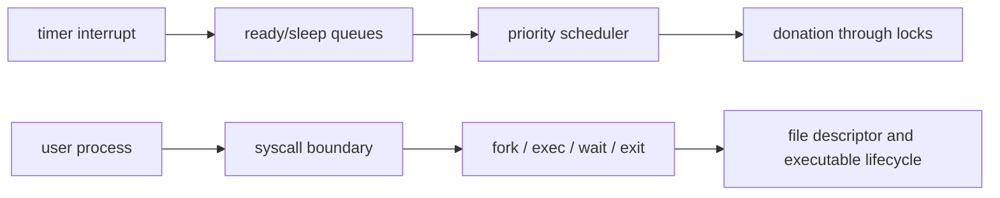

# Pintos Phase 1 — Threads & User Programs

> A C-based operating-system implementation lab focused on scheduling, synchronization, and user-process lifecycle in KAIST Pintos.

운영체제의 스케줄링·동기화·프로세스 경계를 교재 설명이 아니라 실제 커널 코드와 테스트로 이해하기 위해 진행한 팀 프로젝트입니다.

## Project continuity

This repository is the Phase 1 implementation record for Threads and User Programs. The work continues in the team’s [Phase 2 virtual-memory repository](https://github.com/whiskend/pintos_302_G1), while the code-free [Pintos project index](https://github.com/NearthYou/pintos-os-lab) connects both phases and their evidence.

## What we implemented

The implementation spans timer-driven scheduling, synchronization primitives, user-process creation and teardown, and the syscall boundary. The table describes team scope; it does not assign every row to one person.

| Area | Team implementation | Evidence |
| --- | --- | --- |
| Threads | alarm clock, priority scheduling/donation, MLFQS integration | PR #43, PR #46, `thread.c`, `synch.c` |
| User process lifecycle | fork/exec load synchronization, one-time wait, exit notification and cleanup | PR #166, `process.c` |
| Syscall boundary | pointer validation, syscall dispatch, files and descriptors | PR #162–#170, `syscall.c` |
| Kernel/user cleanup safety | USERPROG-conditional exit and interrupt-safe scheduling path | PR #171, `thread.c` |

In particular, priority donation propagates through lock holders, while `process_exec` and `process_wait` coordinate the observable parent/child lifecycle.

## Architecture



The upper path captures kernel scheduling and synchronization; the lower path follows a user process from its syscall entry to child-state, descriptor, and executable cleanup.

## Key engineering decisions

- **Keep wake-up and dispatch policy explicit.** Sleeping threads are ordered by wake-up tick, ready threads are ordered by effective priority, and preemption is checked when a higher-priority thread becomes runnable.
- **Attach priority donation to lock ownership.** Donation follows the holder chain and is recalculated when lock relationships change, while MLFQS bypasses manual donation.
- **Synchronize process load and exit as separate events.** Fork/exec load completion, one-time parent wait, child exit notification, and resource cleanup use distinct state so a parent does not confuse “loaded” with “finished.”
- **Validate at the syscall boundary.** User pointers and strings are checked before kernel dereference; syscall handlers own descriptor and executable-file lifecycle decisions.
- **Separate kernel-only and user-process teardown.** USERPROG guards prevent kernel threads from entering user-process cleanup, and interrupt context is kept out of unsafe scheduling paths.

## Contributions and evidence

Personal authorship, team-integrated scope, merged commits, and branch-only exploration are separated in [Contributions — Phase 1](docs/portfolio/CONTRIBUTIONS.md). The distinction matters: repository history is evidence, but an unmerged branch is not evidence of final `main` behavior.

## Fresh verification

The fresh run against `main` at `739dc58` on 2026-07-18 produced these concrete summaries:

- Threads: `All 27 tests passed.`
- User Programs: `All 95 tests passed.`

Commands, environment details, compiler-warning caveats, and historical merged-PR evidence are recorded in [Phase 1 verification](docs/portfolio/VERIFICATION.md).

## Run locally

Prerequisites are Docker Desktop, Visual Studio Code, and the Dev Containers extension. Open this repository in its checked-in Dev Container, then run:

```bash
cd pintos
source ./activate
make -C threads check
make -C userprog check
```

## Known limitations

- This phase covers Threads and User Programs; virtual memory is continued in Phase 2.
- The fresh suites completed successfully, but the current codebase emits compiler warnings. Verification records them rather than presenting warning-free output.
- Branch-only experiments, including scheduling PR #42, are not evidence of the implementation on final `main`.

## Continue to Phase 2

Continue with virtual memory in [pintos_302_G1](https://github.com/whiskend/pintos_302_G1), or return to the cross-phase [Pintos project index](https://github.com/NearthYou/pintos-os-lab) for the portfolio narrative and verification links.

## License and attribution

This repository builds on the KAIST Pintos educational codebase and the original Pintos project. See [`pintos/LICENSE`](pintos/LICENSE) for the source license and attribution terms. Team and personal implementation claims are limited to the evidence documented in this repository.
