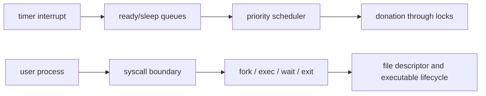

# Pintos Phase 1 — Threads & User Programs

> A C-based operating-system implementation lab focused on scheduling, synchronization, and user-process lifecycle in KAIST Pintos.

운영체제의 스케줄링·동기화·프로세스 경계를 교재 설명이 아니라 실제 커널 코드와 테스트로 이해하기 위해 진행한 팀 프로젝트입니다.

## Project continuity

이 저장소는 Threads와 User Programs를 다룬 Phase 1 구현 기록입니다. 작업은 팀의 [Phase 2 가상 메모리 저장소](https://github.com/whiskend/pintos_302_G1)로 이어집니다. 코드가 없는 [Pintos 프로젝트 인덱스](https://github.com/NearthYou/pintos-os-lab)는 두 단계의 설명과 근거를 연결합니다.

## What we implemented

구현 범위는 타이머 기반 스케줄링, 동기화 primitive, 사용자 프로세스 생성과 종료, 시스템 콜 경계입니다. 아래 표는 팀 구현 범위와 근거를 구분하며, 각 행 전체를 특정 개인의 단독 작업으로 귀속하지 않습니다.

| 영역 | 팀 구현 범위 | 근거 |
| --- | --- | --- |
| 스레드 | alarm clock, 우선순위 스케줄링과 priority donation, MLFQS 통합 | PR #43, PR #46, `thread.c`, `synch.c` |
| 사용자 프로세스 생명주기 | fork/exec 로드 동기화, 한 번만 가능한 wait, 종료 통지와 정리 | PR #166, `process.c` |
| 시스템 콜 경계 | 포인터 검증, 시스템 콜 dispatch, 파일과 descriptor 관리 | PR #162–#170, `syscall.c` |
| 커널/사용자 정리 안전성 | USERPROG 조건부 종료와 interrupt-safe 스케줄링 경로 | PR #171, `thread.c` |

priority donation은 잠금 보유자 체인을 따라 전파되며, `process_exec`와 `process_wait`는 부모가 관찰하는 자식 프로세스의 로드·종료 생명주기를 조정합니다.

## Architecture



위쪽 흐름은 커널 스케줄링과 동기화를 나타냅니다. 아래쪽 흐름은 사용자 프로세스가 시스템 콜로 진입한 뒤 자식 상태, descriptor, 실행 파일을 정리하는 경로를 나타냅니다.

## Key engineering decisions

- **깨우기와 실행 정책을 명시적으로 유지합니다.** 잠든 스레드는 wake-up tick 순서로, 준비된 스레드는 유효 우선순위 순서로 관리하며 더 높은 우선순위가 runnable 상태가 되면 선점을 검사합니다.
- **priority donation을 잠금 소유권에 묶습니다.** donation은 lock holder 체인을 따라가고 잠금 관계가 달라질 때 다시 계산하며, MLFQS에서는 수동 donation을 적용하지 않습니다.
- **프로세스 로드와 종료를 별도 사건으로 동기화합니다.** fork/exec 로드 완료, 부모의 one-time wait, 자식 종료 통지, 자원 정리를 분리해 “로드됨”과 “종료됨”을 혼동하지 않습니다.
- **시스템 콜 경계에서 검증합니다.** 커널이 역참조하기 전에 사용자 포인터와 문자열을 확인하고, syscall handler가 descriptor와 실행 파일의 생명주기를 관리합니다.
- **커널 전용 스레드와 사용자 프로세스의 정리를 분리합니다.** USERPROG guard로 커널 스레드가 사용자 프로세스 정리에 들어가지 않게 하고, interrupt context에서 안전하지 않은 스케줄링을 피합니다.

## Contributions and evidence

개인 기여, 팀 통합 범위, 병합된 커밋, 브랜치에만 남은 탐색 작업은 [Contributions — Phase 1](docs/portfolio/CONTRIBUTIONS.md)에서 구분합니다. 저장소 이력은 근거이지만 병합되지 않은 브랜치는 최종 `main` 동작의 근거가 아닙니다.

## Fresh verification

2026-07-18에 `main`의 `739dc58`을 fresh 검증한 결과는 다음과 같습니다.

- Threads: `All 27 tests passed.`
- User Programs: `All 95 tests passed.`

검증 결과, 재현 명령과 환경, Docker build client의 timeout, 컴파일 경고, 병합된 PR 이력은 [Phase 1 검증 문서](docs/portfolio/VERIFICATION.md)에 기록합니다.

## Run locally

준비물은 Docker Desktop, Visual Studio Code, Dev Containers 확장입니다. 이 저장소를 체크인된 개발 컨테이너에서 연 뒤 다음 명령을 실행합니다.

```bash
cd pintos
source ./activate
make -C threads check
make -C userprog check
```

## Known limitations

- 이 단계는 Threads와 User Programs를 다루며, 가상 메모리는 Phase 2에서 이어집니다.
- fresh suite는 완료됐지만 현재 코드베이스는 컴파일 경고를 출력합니다. 따라서 경고 없는 빌드라고 주장하지 않습니다.
- 스케줄링 PR #42를 포함한 브랜치 전용 실험은 최종 `main` 구현의 근거가 아닙니다.

## Continue to Phase 2

가상 메모리 구현은 [pintos_302_G1](https://github.com/whiskend/pintos_302_G1)에서 이어집니다. 단계별 설명과 검증 링크는 코드가 없는 [Pintos 프로젝트 인덱스](https://github.com/NearthYou/pintos-os-lab)에서 함께 볼 수 있습니다.

## License and attribution

이 저장소는 KAIST Pintos 교육용 코드베이스와 원본 Pintos 프로젝트를 기반으로 합니다. 소스 라이선스와 귀속 조건은 [`pintos/LICENSE`](pintos/LICENSE)를 따르며, 팀과 개인의 구현 주장은 이 저장소에 기록한 근거 범위로 제한합니다.
