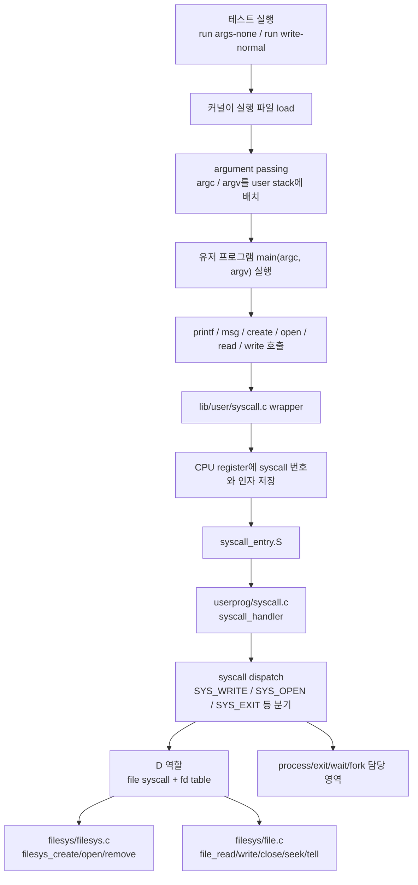
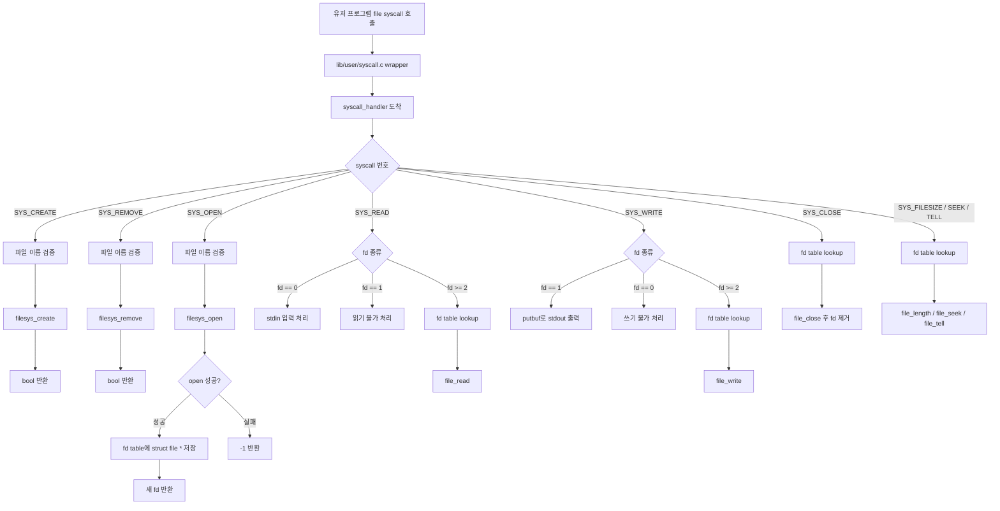
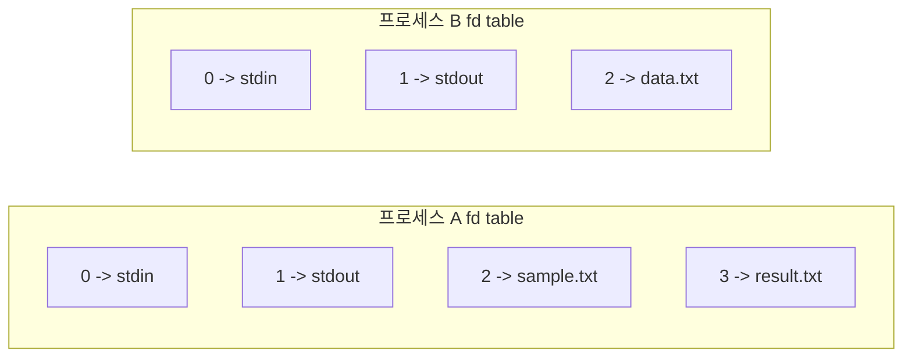
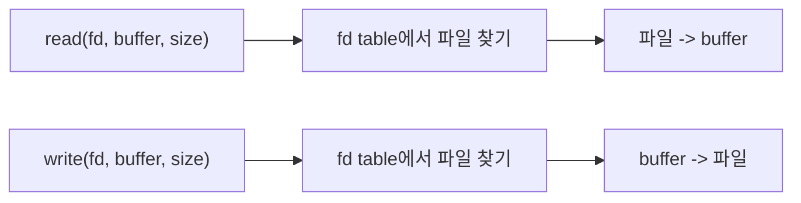
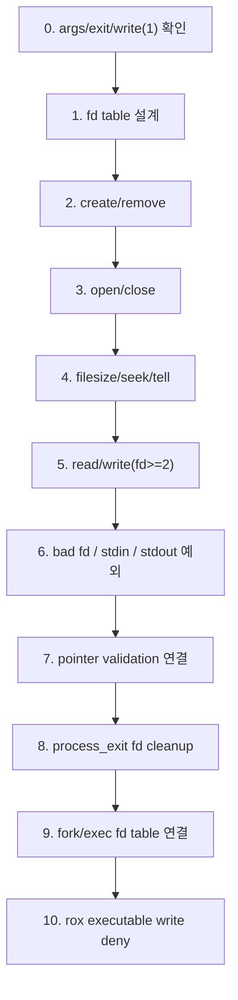
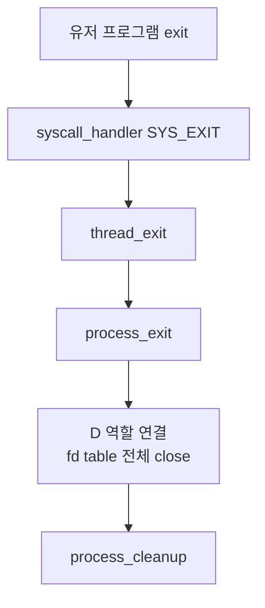
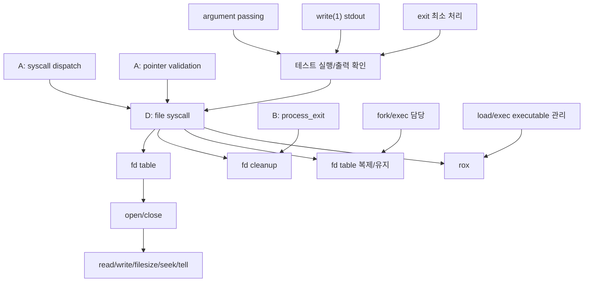

# Pintos Project 2 D Role Guide

이 문서는 Project 2 User Programs에서 D 역할, 즉 file syscall과 fd table 담당자가 전체 흐름 안에서 무엇을 맡는지 정리한 문서다.

구현 정답 코드가 아니라, 회의와 구현 전에 흐름을 이해하기 위한 지도다.

## 1. 전체 흐름에서 D 역할 위치

Project 2는 유저 프로그램을 실행하고, 유저 프로그램이 커널에 syscall로 부탁하는 구조다.



D 역할은 syscall 전체의 입구가 아니라, `syscall_handler`가 파일 관련 syscall을 알아본 뒤 실제 파일 기능과 fd table을 연결하는 부분이다.

쉽게 말하면:

```text
syscall_handler = 접수대
D 역할 = 파일 업무 담당 창구
fd table = 열린 파일 번호표 장부
```

## 2. D 역할의 핵심 한 문장

D는 유저 프로그램이 직접 파일 포인터를 만질 수 없기 때문에, 커널 안에서 파일을 열고 번호표(fd)를 만들어 관리한다.

```text
open("sample.txt")
-> 커널이 struct file *을 얻음
-> 현재 프로세스 fd table에 저장
-> 유저에게 fd 번호 반환

read(fd, buffer, size)
-> fd table에서 fd에 해당하는 struct file * 찾음
-> file_read 호출

write(fd, buffer, size)
-> fd == 1이면 stdout 특수 처리
-> fd >= 2이면 fd table에서 파일 찾고 file_write 호출

close(fd)
-> fd table에서 파일 제거
-> file_close 호출
```

## 3. D 역할 내부 흐름도



## 4. fd table 개념

fd는 file descriptor의 줄임말이고, 유저 프로그램이 파일을 직접 만지는 대신 사용하는 숫자 번호다.

```text
fd 0 = stdin, 키보드 입력
fd 1 = stdout, 화면 출력
fd 2 이상 = open으로 연 파일
```

프로세스마다 fd table이 따로 필요하다. 같은 fd 번호라도 프로세스마다 다른 파일을 가리킬 수 있기 때문이다.



중요한 점:

```text
write(1, buffer, size)
-> stdout 특수 처리
-> fd table 없어도 가능

write(3, buffer, size)
-> 3번이 어떤 파일인지 fd table에서 찾아야 함
-> fd table 없이는 불가능
```

## 5. D가 알아야 하는 syscall

| syscall | 한 줄 의미 | fd table 필요 | 특수 fd 관련 | 성공 반환 | 실패 반환/처리 |
|---|---|---:|---|---|---|
| `create` | 새 파일 생성 | 아니오 | 없음 | `true` | `false` 또는 bad pointer 시 종료 |
| `remove` | 파일 삭제 | 아니오 | 없음 | `true` | `false` 또는 bad pointer 시 종료 |
| `open` | 파일 열고 fd 받기 | 예, 추가 | 반환 fd는 보통 2 이상 | 새 fd | `-1` |
| `filesize` | 열린 파일 크기 확인 | 예, 조회 | fd 0/1은 보통 실패 | 파일 크기 | `-1` |
| `read` | 파일/키보드에서 buffer로 읽기 | fd >= 2는 예 | fd 0은 stdin, fd 1은 실패 | 읽은 byte 수 | `-1` 또는 종료 |
| `write` | buffer 내용을 화면/파일에 쓰기 | fd >= 2는 예 | fd 1은 stdout, fd 0은 실패 | 쓴 byte 수 | `-1` 또는 종료 |
| `seek` | 파일 위치 이동 | 예, 조회 | fd 0/1은 실패 | 반환 없음 | 조용히 실패 가능 |
| `tell` | 현재 파일 위치 확인 | 예, 조회 | fd 0/1은 실패 | 현재 위치 | 실패 시 정책 필요 |
| `close` | 열린 fd 닫기 | 예, 제거 | fd 0/1 처리 정책 필요 | 반환 없음 | bad fd는 실패/종료 |

`dup2`는 extra이므로 이번 범위에서는 제외한다.

## 6. read와 write 차이

둘 다 fd table에서 파일을 찾을 수 있지만, 데이터 방향이 반대다.



정리:

```text
read(fd=0)
-> 키보드에서 buffer로 읽기

write(fd=1)
-> buffer를 화면에 출력

read(fd>=2)
-> fd table에서 파일 찾고 파일 내용을 buffer에 복사

write(fd>=2)
-> fd table에서 파일 찾고 buffer 내용을 파일에 씀

bad fd
-> 실패값 반환 또는 프로세스 종료
```

## 7. D 역할 구현 순서

argument passing이 들어온다는 가정에서 D 역할은 아래 순서가 안전하다.



### 0. 준비 확인

먼저 이 흐름이 보이면 좋다.

```text
argument passing 완료
write(1) stdout 출력 가능
exit 최소 처리 가능
```

확인 대상:

```text
args-none
args-single
args-multiple
exit
```

### 1. fd table 설계

회의에서 먼저 정해야 한다.

```text
fd table을 struct thread 안에 둘 것인가?
fd 0/1은 table에 넣을 것인가, 특수 처리할 것인가?
next_fd는 2부터 시작할 것인가?
fd table 크기는 고정 배열인가, list인가?
fork 때 fd table을 복제할 것인가?
exec 후 fd table을 유지할 것인가?
```

일반적으로 Project 2에서는 현재 프로세스 정보를 `struct thread`에 넣는 경우가 많다.

### 2. create/remove

fd table이 없어도 시작할 수 있다.

```text
create(file, initial_size)
-> file 이름 검증
-> filesys_create 호출
-> bool 반환

remove(file)
-> file 이름 검증
-> filesys_remove 호출
-> bool 반환
```

의존성:

```text
syscall dispatch 필요
파일 이름 user pointer 검증 필요
filesys lock 정책 필요
```

### 3. open/close

여기서부터 fd table이 핵심이다.

```text
open(file)
-> filesys_open
-> 성공하면 fd table에 struct file * 저장
-> fd 반환

close(fd)
-> fd table에서 fd 찾기
-> file_close
-> fd table에서 제거
```

### 4. filesize/seek/tell

이 세 개는 fd table lookup 연습에 좋다.

```text
filesize(fd)
-> fd table lookup
-> file_length

seek(fd, position)
-> fd table lookup
-> file_seek

tell(fd)
-> fd table lookup
-> file_tell
```

### 5. read/write(fd >= 2)

이제 파일 입출력이다.

```text
read(fd, buffer, size)
-> buffer 검증
-> fd table lookup
-> file_read
-> 읽은 byte 수 반환

write(fd, buffer, size)
-> buffer 검증
-> fd table lookup
-> file_write
-> 쓴 byte 수 반환
```

주의:

```text
write(1)은 stdout 특수 처리
read(0)은 stdin 특수 처리
fd >= 2만 fd table lookup
```

### 6. bad fd / stdin / stdout 예외

테스트는 이상한 fd도 넣는다.

```text
read(1, ...)
-> stdout은 읽기 대상이 아님

write(0, ...)
-> stdin은 쓰기 대상이 아님

close(999)
-> 없는 fd

read(-1, ...)
-> bad fd
```

팀 정책에 따라 실패값 반환 또는 `exit(-1)` 종료가 가능하다. 단, 일관성이 중요하다.

### 7. pointer validation 연결

D syscall은 유저 포인터를 많이 받는다.

```text
create(file)
open(file)
remove(file)
read(fd, buffer, size)
write(fd, buffer, size)
```

검증 없이 커널이 유저 주소를 읽으면 kernel panic이 날 수 있다.

주의해야 할 테스트:

```text
create-bad-ptr
open-bad-ptr
read-bad-ptr
write-bad-ptr
create-bound
open-boundary
read-boundary
write-boundary
bad-read
bad-write
```

### 8. process_exit fd cleanup

프로세스가 죽을 때 열린 파일을 다 닫아야 한다.



이걸 안 하면 파일이 계속 열린 상태로 남고, 여러 테스트에서 뒤늦게 문제가 생긴다.

### 9. fork/exec fd table 연결

KAIST Pintos의 일부 테스트는 fork/exec 후 fd 사용을 본다.

예시:

```text
부모가 sample.txt open
-> fd = 2
-> fork
-> 자식이 exec 후 fd 2로 read/close
```

그래서 팀과 정해야 한다.

```text
fork 때 fd table을 복제하는가?
복제 시 file_duplicate를 쓰는가?
exec 후 fd table을 유지하는가?
자식이 close해도 부모 fd에 영향이 없어야 하는가?
```

관련 테스트:

```text
fork-read
fork-close
exec-read
multi-child-fd
```

### 10. rox executable write deny

실행 중인 파일에 쓰면 안 되는 기능이다.

```text
프로그램 load
-> 실행 파일을 열어둠
-> file_deny_write

프로그램 exit
-> file_allow_write
-> file_close
```

관련 테스트:

```text
rox-simple
rox-child
rox-multichild
```

이건 load/exit/fd cleanup 흐름이 어느 정도 안정된 뒤 하는 게 안전하다.

## 8. D 역할 의존성 지도



D가 바로 독립적으로 할 수 있는 것:

```text
fd table 설계 초안
create/remove 기본 흐름
open/close 기본 흐름
write(1) stdout 특수 처리
filesize/seek/tell fd lookup 흐름
```

D가 팀원과 맞춰야 하는 것:

```text
syscall dispatch 구조
pointer validation helper
filesys lock 위치
process_exit에서 fd cleanup 호출 위치
fork 때 fd table 복제 정책
exec 후 fd table 유지 정책
rox에서 실행 파일 close/deny write 해제 위치
```

## 9. 테스트 묶음 순서

| 묶음 | 테스트 | D 관점 의미 | 선행 조건 |
|---|---|---|---|
| 0 | `args-*`, `exit` | 테스트 출력/종료 확인 | argument passing, write(1), exit |
| 1 | `create-normal`, `create-empty`, `create-exists`, `create-long` | create 기본 | dispatch, file name 검증 |
| 2 | `open-normal`, `open-missing`, `open-twice` | open + fd table 시작 | fd table |
| 3 | `close-normal`, `close-twice`, `close-bad-fd` | close + fd 제거 | open |
| 4 | `read-normal`, `read-zero`, `write-normal`, `write-zero` | 파일 read/write | open, fd lookup |
| 5 | `read-bad-fd`, `read-stdout`, `write-bad-fd`, `write-stdin` | fd 예외 처리 | fd 정책 |
| 6 | `*-bad-ptr`, `*-boundary` | pointer/buffer 검증 | pointer validation |
| 7 | filesys/base `sm-*`, `lg-*` | create/open/read/write/seek 조합 | 파일 syscall 대부분 |
| 8 | `fork-read`, `fork-close`, `exec-read`, `multi-child-fd` | fd table 복제/유지 | fork/exec 담당과 연결 |
| 9 | `rox-*` | 실행 파일 write deny | load/exit/fd cleanup |

## 10. D 담당자가 회의에서 물어볼 질문

```text
fd table은 struct thread 안에 둘까요?
fd table은 배열로 할까요, list로 할까요?
fd 0/1은 table에 넣을까요, 특수 처리할까요?
next_fd는 2부터 시작할까요?
bad fd는 -1 반환으로 통일할까요, exit(-1)로 죽일까요?
user pointer 검증 helper는 누가 만들고 어떤 함수 이름으로 쓸까요?
file system lock은 syscall_handler 바깥에서 잡을까요, 각 file syscall 안에서 잡을까요?
process_exit에서 fd cleanup은 누가 호출할까요?
fork 때 fd table 복제는 D가 할까요, fork 담당자가 D helper를 호출할까요?
exec 후 fd table은 유지하는 정책으로 갈까요?
rox에서 executable file 관리는 process 담당과 D가 어떻게 나눌까요?
dup2 extra는 안 하는 것으로 확정인가요?
```

## 11. 구현 접근법

처음부터 모든 syscall을 한 번에 완성하려고 하면 흐름이 섞인다.

추천 접근:

```text
1. 정상 케이스를 먼저 만든다.
2. fd table lookup helper 흐름을 안정화한다.
3. bad fd 처리를 붙인다.
4. pointer validation을 붙인다.
5. process_exit cleanup을 붙인다.
6. fork/exec/rox 연결을 마지막에 맞춘다.
```

D 역할에서 계속 기억할 핵심:

```text
open은 fd table에 파일을 넣는다.
read/write/filesize/seek/tell/close는 fd table에서 파일을 찾는다.
fd 0과 fd 1은 일반 파일이 아니라 특수 번호다.
write(1)은 stdout이라 fd table 없이 가능하다.
write(fd>=2)는 fd table 없이는 불가능하다.
프로세스가 죽으면 fd table을 정리해야 한다.
fork/exec는 fd table 정책을 팀과 맞춰야 한다.
pointer validation 없이는 robustness 테스트에서 kernel panic이 날 수 있다.
```

## 12. 오늘 기준 한 줄 목표

argument passing이 들어온 뒤에는 먼저 `args-*` 출력과 `exit` 종료를 확인하고, 그 다음 D 역할은 `fd table -> open/close -> read/write(fd>=2)` 순서로 가면 된다.
